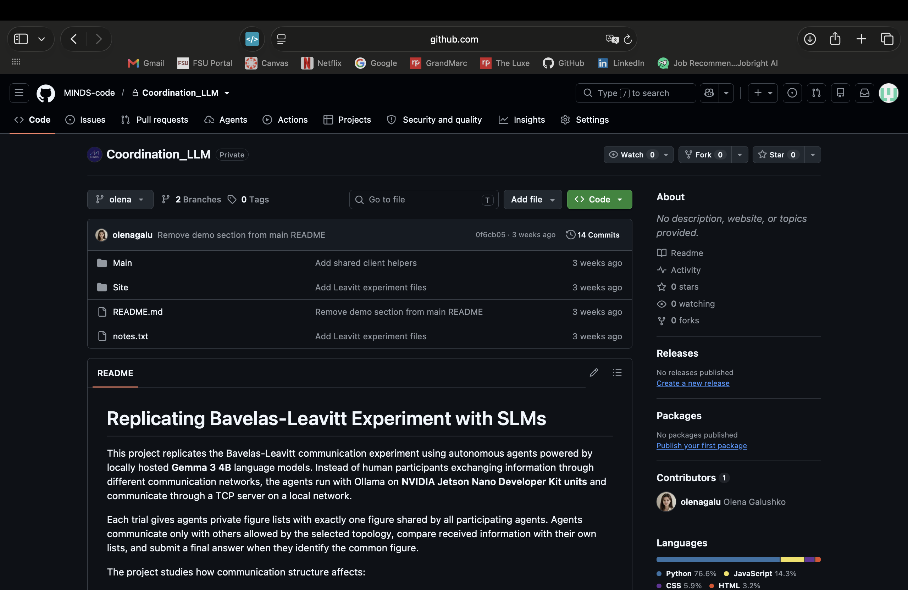

# Replicating the Bavelas-Leavitt Experiment with SLMs

This project replicates the Bavelas-Leavitt communication experiment using autonomous agents powered by locally hosted small language models. Instead of human participants exchanging information through different communication networks, the agents run with Ollama on NVIDIA Jetson devices and communicate through a TCP server on a local network.

Each trial gives agents private figure lists with exactly one figure shared by all participating agents. Agents communicate only with others allowed by the selected topology, compare received information with their own lists, and submit a final answer when they identify the common figure.

## Demo

[Open the interactive browser demo](https://olenagalu.github.io/leavitt-experiment/)

The demo recreates the dashboard interface with simulated agents, messages, network routes, and results. It does not require access to the live Jetson network.



## Communication topologies

- **Broadcast:** every message is visible to all participating agents.
- **Circle:** each agent communicates with its two immediate neighbors.
- **Chain:** agents communicate only with adjacent agents in a line.
- **Y:** communication follows a branched network with a central junction.
- **Wheel:** peripheral agents communicate through a central agent.

The experiment records whether a trial succeeds, the submitted and correct figures, elapsed time, total messages, routes between agents, model settings, and device temperatures during automated studies.

## Project structure

- `Main/` contains the TCP experiment server and topology-aware Jetson clients.
- `Site/` contains the live dashboard and its HTTP/TCP coordination server.
- `Public-Demo/` contains the standalone browser demonstration linked above.
- `notes.txt` contains local deployment and automated-study instructions.

## Running the live dashboard

Start the dashboard server on the server Jetson:

```bash
sudo python3 Site/dashboard_server.py \
  --http-host 0.0.0.0 --http-port 80 \
  --tcp-host 0.0.0.0 --tcp-port 5001
```

Then open the server Jetson's address in a browser and connect the client Jetsons using `Main/client.py`.
